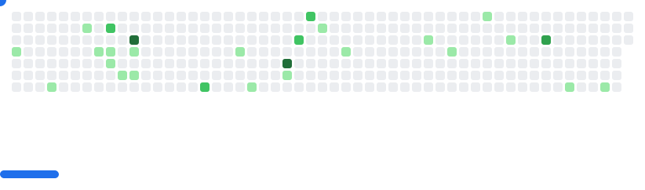

<h1 align="center">Hi 👋, I'm qSTARp</h1>
<h3 align="center">A student majoring in Artificial Intelligence</h3>

- 🔭 I’m currently studying at the **University of Nottingham**

- 📝 I sometimes write articles on [https://zefei.site/](https://zefei.site/)

- 📫 How to reach me **scyzx4@nottingham.ac.uk**

  

<h3 align="left">Languages and Tools:</h3>

<table>
  <tr>
    <td></td>
    <td></td>
    <td></td>
    <td></td>
    <td></td>
    <td></td>
    <td></td>
    <td></td>
  </tr>
  <tr>
    <td></td>
    <td></td>
    <td></td>
    <td></td>
    <td></td>
    <td></td>
    <td></td>
  </tr>
</table>

<picture>
  <source
    media="(prefers-color-scheme: dark)"
    srcset="images/breakout-dark.svg"
  />
  <source
    media="(prefers-color-scheme: light)"
    srcset="images/breakout-light.svg"
  />
  
</picture>

