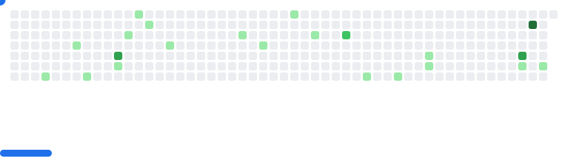

# Hi 👋, I'm qSTARp

### AI Engineer | NLP & LLMs | AI Agents & Human-AI Interaction

---

## About Me

- 🎓 Master's student in **Intelligent Information Systems (MIIS)** at **Carnegie Mellon University**
- 🔬 Interested in **NLP, LLMs, AI Agents, AI Systems, and Human-AI Interaction**
- 🧠 Exploring how to build **reliable, interpretable, and practical AI systems**
- 📚 Previously studied **Computer Science with Artificial Intelligence** at the **University of Nottingham**
- ✍️ I sometimes write about AI, research, and software engineering on **[zefei.site](https://zefei.site/)** and my academic website [https://the-lord-of-stars.github.io/](https://the-lord-of-stars.github.io/)
- 📫 Contact me at **[zefei0521@gmail.com]**

---

## Languages and Tools

  

---

## Publications

### 🔍 AwesomeLit: Transparent Human-AI Collaboration for Literature Exploration

**EuroVis 2026 Short Paper**

**Zefei Xie**, Yuhan Guo, Kai Xu

A human-AI collaborative literature exploration system combining **LLMs, retrieval-augmented generation, semantic visualization, and interactive exploration** to make AI-assisted research more transparent and controllable.

  
  

---

### 🤖 What Happened to Automated Visualization? An Agentic Analysis

**1st Workshop on GenAI, Agents, and the Future of VIS · 2025**

Weiyao Meng, Yuhan Guo, **Zefei Xie**, Kai Xu

An automated visualization pipeline powered by **LLM-based agents**, exploring how agentic workflows can automate **data analysis, visualization generation, and report creation**.

  
  

---

## Contribution Activity

<picture>
  <source
    media="(prefers-color-scheme: dark)"
    srcset="images/breakout-dark.svg"
  />
  <source
    media="(prefers-color-scheme: light)"
    srcset="images/breakout-light.svg"
  />
  
</picture>

