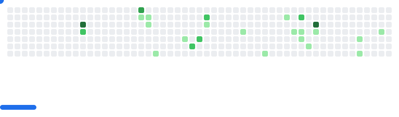

<h1 align="center">Hi 👋, I'm the-lord-of-stars</h1>
<h3 align="center">A student majoring in artificial intelligence</h3>

- 🔭 I’m currently studying in **University of Nottingham**

- 📝 I sometimes write articles on [https://the-lord-of-stars.github.io/](https://the-lord-of-stars.github.io/)

- 📫 How to reach me **scyzx4@nottingham.ac.uk**

<h3 align="left">Connect with me:</h3>

<h3 align="left">Languages and Tools:</h3>

                

&nbsp;

<picture>
  <source
    media="(prefers-color-scheme: dark)"
    srcset="images/breakout-dark.svg"
  />
  <source
    media="(prefers-color-scheme: light)"
    srcset="images/breakout-light.svg"
  />
  
</picture>

<!--
**the-lord-of-stars/the-lord-of-stars** is a ✨ _special_ ✨ repository because its `README.md` (this file) appears on your GitHub profile.

Here are some ideas to get you started:

- 🔭 I’m currently working on ...
- 🌱 I’m currently learning ...
- 👯 I’m looking to collaborate on ...
- 🤔 I’m looking for help with ...
- 💬 Ask me about ...
- 📫 How to reach me: ...
- 😄 Pronouns: ...
- ⚡ Fun fact: ...
-->
